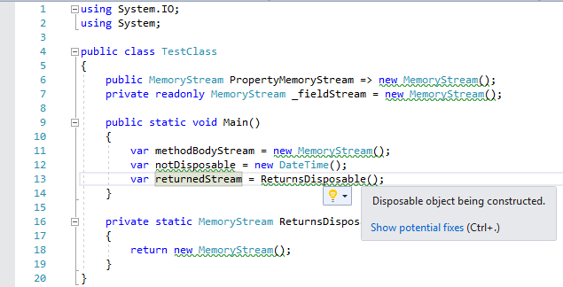

Marks IDisposable objects that are being constructed.

It's often difficult to remember which objects implement IDisposable and not
disposing of them can have dire consequences. Marking the objects inside Visual
Studio gives a visual cue to the developer to ensure they're handled.

## TODO
* Add nuget package to the release section.
* Configurable?
* Ignore disposables constructed inside 'using' statements.
* Mark fields/variables that have a type associated with being disposable.
* Do not mark benign types such as MemoryStream and Task who's Dispose methods are (mostly) no-ops.
* Make disposing of a Task in using() { } statements an error because it usually indicates a missing await.

## Release log
### 1.0 (March 11th, 2018)
* Initial release.